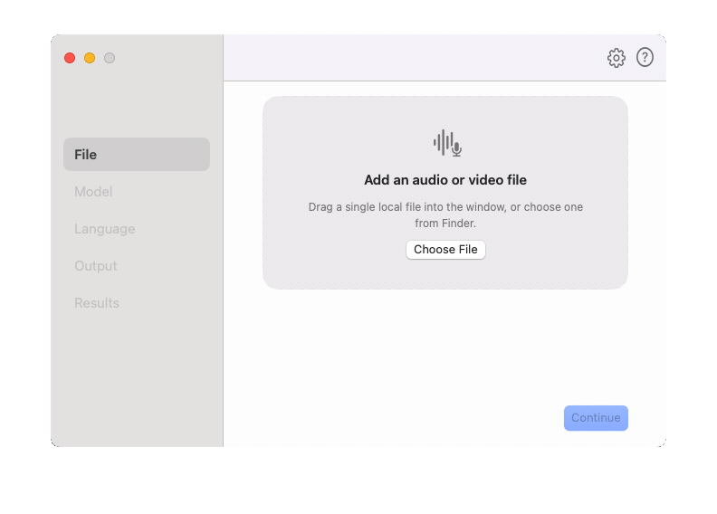

# Whisper for Mac

Whisper for Mac is a fast, native macOS app for offline speech-to-text using OpenAI’s Whisper models.
It runs entirely on-device with no Python, no cloud, and no setup required — just download a model and start transcribing.



## Features

- ⚡ Fast on-device transcription using `whisper.cpp`
- 🧠 Apple Silicon acceleration (Core ML where available)
- 🔒 100% offline & private — no data leaves your Mac
- 🎯 Multiple model support (tiny → large, multilingual + English-only)
- 🌍 Translation & language detection
- 📊 Live progress feedback & timestamps
- 🧵 Optimized multi-threaded inference
- 🖥️ Clean native macOS UI (SwiftUI)

## Using Whisper for Mac

1. Build the app or open a shared `.app` bundle.
2. Open Settings and install the Whisper model you want to use.
3. Drag and drop an audio or video file into the app.
4. Confirm the transcription job.
5. Find the output files next to the source media or in your configured output folder.

## Requirements

- macOS 15 or newer
- Apple Silicon or Intel Mac
- Internet connection only for downloading Whisper models

## Installation

Right now, the main path is building the app locally from this repository:

```bash
git clone https://github.com/AwakeAndReady/whisper-for-mac.git
cd whisper-for-mac
./script/build_and_run.sh
```

The build script creates app bundles in `dist/`:

- `WhisperForMac.app` (Universal)
- `WhisperForMac-AppleSilicon.app`
- `WhisperForMac-Intel.app`

A built `.app` can also be shared directly with another user.

## Development

Use the build script for local development:

```bash
./script/build_and_run.sh
```

Other useful modes:

```bash
./script/build_and_run.sh --verify
./script/build_and_run.sh --logs
./script/build_and_run.sh --telemetry
./script/build_and_run.sh --debug
```

## Current Limitations

- No Whisper model is bundled with the app
- The first transcription requires downloading a model
- The app is already usable, but it is still evolving

## Notes

- The app is local-first and does not upload files for transcription
- Models are downloaded on demand and stored locally
- The default outputs are `.txt` and `.vtt`

## Feedback

If the project looks useful to you, issues, ideas, and real-world testing feedback are very welcome.
